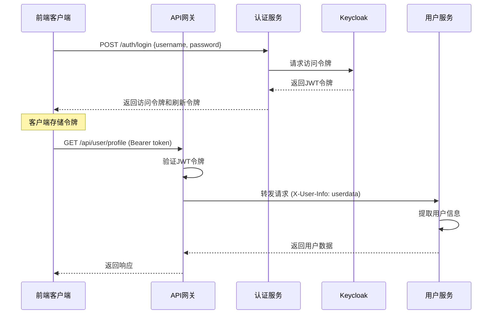

# 现代微服务认证架构完整实现

这是一个完整的现代微服务认证授权解决方案，采用 **API网关 + JWT + Keycloak + Spring Security** 的架构模式。

## 🏗️ 架构概览

```
┌─────────────┐    ┌──────────────┐    ┌─────────────────┐
│   前端应用   │───▶│   API网关     │───▶│   微服务集群     │
│  (React/Vue) │    │ (Spring Gateway)│    │ (Spring Boot)   │
└─────────────┘    └──────────────┘    └─────────────────┘
       │                    │                     │
       │                    │                     │
       └──────────────────▶ │ ◀───────────────────┘
                            │
                    ┌───────▼────────┐
                    │   Keycloak     │
                    │  (认证服务器)    │
                    └────────────────┘
```

## 🎯 核心特点

- ✅ **统一认证**: Keycloak提供集中式认证服务
- ✅ **网关验证**: API网关统一处理JWT验证
- ✅ **服务解耦**: 微服务专注业务逻辑
- ✅ **权限控制**: 支持方法级别的细粒度权限控制
- ✅ **高性能**: 无状态JWT，支持水平扩展
- ✅ **标准协议**: 基于OAuth2/OpenID Connect

## 📁 项目结构

```
microservice-auth-demo/
├── gateway/                    # API网关服务
│   ├── src/main/java/com/example/gateway/
│   │   └── config/
│   │       ├── GatewayConfig.java           # 路由配置
│   │       └── JwtAuthenticationFilter.java # JWT验证过滤器
│   └── src/main/resources/
│       └── application.yml                  # 网关配置
│
├── auth-service/              # 认证服务
│   ├── src/main/java/com/example/authservice/
│   │   ├── controller/
│   │   │   └── AuthController.java          # 认证接口
│   │   ├── service/
│   │   │   └── AuthService.java             # Keycloak集成
│   │   └── dto/
│   │       ├── LoginRequest.java            # 登录请求DTO
│   │       └── LoginResponse.java           # 登录响应DTO
│
├── user-service/              # 用户微服务
│   └── src/main/java/com/example/userservice/
│       ├── config/
│       │   ├── SecurityConfig.java          # Security配置
│       │   └── UserInfoExtractionFilter.java # 用户信息提取
│       └── controller/
│           └── UserController.java          # 用户业务接口
│
└── keycloak-config/           # Keycloak配置
    ├── docker-compose.yml                   # 基础设施部署
    ├── realm-export.json                    # Keycloak领域配置
    └── init-db.sql                         # 数据库初始化
```

## 🚀 快速启动

### 1. 启动基础设施

```bash
cd keycloak-config
docker-compose up -d
```

这将启动：
- Keycloak (端口: 8180)
- MySQL (端口: 3306)
- Redis (端口: 6379)
- Nacos (端口: 8848)

### 2. 配置Keycloak

1. 访问 http://localhost:8180/admin
2. 使用 admin/admin123 登录
3. 导入 `realm-export.json` 配置
4. 验证客户端和用户配置

### 3. 启动服务

按以下顺序启动各个服务：

```bash
# 1. 启动认证服务
cd auth-service
mvn spring-boot:run

# 2. 启动用户服务
cd user-service
mvn spring-boot:run

# 3. 启动API网关
cd gateway
mvn spring-boot:run
```

## 🔄 完整认证流程

### 1. 用户登录流程



### 2. API调用示例

**登录获取令牌：**
```bash
curl -X POST http://localhost:8080/auth/login \
  -H "Content-Type: application/json" \
  -d '{
    "username": "testuser",
    "password": "testpassword"
  }'
```

**使用令牌访问受保护资源：**
```bash
curl -X GET http://localhost:8080/api/user/profile \
  -H "Authorization: Bearer YOUR_ACCESS_TOKEN"
```

**管理员权限API：**
```bash
curl -X GET http://localhost:8080/api/user/list \
  -H "Authorization: Bearer ADMIN_ACCESS_TOKEN"
```

## 🔐 权限控制示例

### 方法级权限控制

```java
@PreAuthorize("hasRole('ADMIN')")
@GetMapping("/admin-only")
public ResponseEntity<String> adminOnlyEndpoint() {
    return ResponseEntity.ok("只有管理员可以看到这个内容");
}

@PreAuthorize("hasRole('ADMIN') or #userId == authentication.principal.userId")
@PutMapping("/{userId}")
public ResponseEntity<String> updateUser(@PathVariable String userId) {
    // 用户只能更新自己的信息，管理员可以更新任何用户
    return ResponseEntity.ok("更新成功");
}
```

### URL级权限控制

```java
// 在SecurityConfig中配置
http.authorizeHttpRequests(authz -> authz
    .requestMatchers("/api/public/**").permitAll()      // 公开API
    .requestMatchers("/api/admin/**").hasRole("ADMIN")  // 管理员API
    .anyRequest().authenticated()                       // 其他需要认证
);
```

## 🔧 关键配置说明

### API网关配置

```yaml
# application.yml
spring:
  cloud:
    gateway:
      routes:
        - id: user-service
          uri: lb://user-service
          predicates:
            - Path=/api/user/**
          filters:
            - StripPrefix=1
            - name: JwtAuthenticationFilter
```

### Keycloak集成配置

```yaml
keycloak:
  auth-server-url: http://localhost:8180/auth
  realm: microservice-realm
  resource: gateway-client
  credentials:
    secret: your-client-secret
```

### 微服务Security配置

```java
@Configuration
@EnableWebSecurity
@EnableGlobalMethodSecurity(prePostEnabled = true)
public class SecurityConfig {
    @Bean
    public SecurityFilterChain filterChain(HttpSecurity http) {
        return http
            .sessionManagement(s -> s.sessionCreationPolicy(STATELESS))
            .addFilterBefore(new UserInfoExtractionFilter(), 
                           UsernamePasswordAuthenticationFilter.class)
            .build();
    }
}
```

## 🎨 技术特点

### 1. **性能优化**
- 网关层统一JWT验证，减少重复验证
- 无状态设计，支持水平扩展
- Redis缓存用户会话信息

### 2. **安全性**
- JWT令牌签名验证
- HTTPS传输加密
- RBAC角色权限控制
- 令牌过期和刷新机制

### 3. **可维护性**
- 职责清晰分离
- 统一的错误处理
- 完整的日志追踪
- 标准化的API响应格式

## 🔍 测试用例

项目包含完整的测试用例：

```java
@Test
@WithMockUser(roles = "ADMIN")
public void testAdminAccess() {
    // 测试管理员权限
}

@Test
public void testJwtValidation() {
    // 测试JWT验证逻辑
}

@Test
public void testUserInfoExtraction() {
    // 测试用户信息提取
}
```

## 📈 监控和日志

- **健康检查**: `/actuator/health`
- **指标监控**: `/actuator/metrics`
- **链路追踪**: Spring Cloud Sleuth
- **集中日志**: ELK Stack

## 🚀 生产部署建议

1. **使用HTTPS**: 所有API调用必须使用HTTPS
2. **令牌安全**: 配置合适的令牌过期时间
3. **监控告警**: 设置认证失败和异常访问告警
4. **负载均衡**: 使用Nginx或云负载均衡器
5. **数据库**: 生产环境使用PostgreSQL或MySQL
6. **缓存**: 使用Redis Cluster提高可用性

## 🔄 扩展点

1. **多租户支持**: 基于Keycloak Realm实现
2. **单点登录**: 集成第三方身份提供商
3. **API限流**: 在网关层添加限流策略
4. **审计日志**: 记录所有权限相关操作
5. **动态权限**: 基于数据库的动态角色权限系统

这个架构提供了企业级的认证授权解决方案，既保证了安全性，又具备了良好的可扩展性和维护性。
